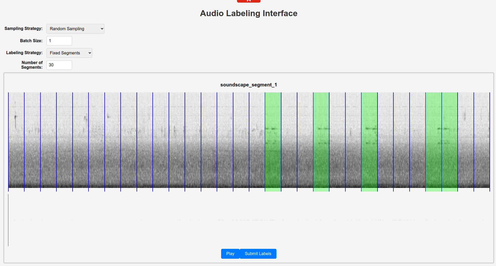

# Audio Annotation Interface



A simple and interactive audio annotation interface that allows users to select different sampling and labeling strategies to efficiently label audio segments.

## Features

- **Sampling Strategies:** Choose how audio recordings are selected for annotation.
- **Labeling Strategies:** Define how audio recordings are segmented for labeling.
- **Iterative Model Updates:** Labels are stored and used to update the underlying model for improved predictions.

## Sampling Strategies
The following sampling strategies are implemented:

- **Uncertainty Sampling**: Selects the audio recording where the model predictions have the highest average entropy.
- **Random Sampling**: Selects a random audio recording.
- **Certainty Sampling**: Selects the audio recording where the model predictions have the lowest average entropy.
- **High Probability Sampling**: Selects the audio recording where the model predictions have the highest average predicted presence probability.

## Labeling Strategies
Two labeling strategies are available:

- **Fixed Segments**: Splits the audio recording into equal-length segments.
- **Adaptive Segments**: Uses model predictions to derive plausible segmentations based on change-point detection.

## Label Storage and Model Updates
Each time the user clicks **"Submit Labels"**, the labels are stored in the `./data/example/labels` directory. The underlying model is then updated with these new labels to refine future label suggestions.

## Relevant Research
This tool is based on research exploring the accuracy and efficiency of weak labeling strategies:

- **[The Accuracy Cost of Weak Labeling](https://johnmartinsson.org/publications/2025/the-accuracy-cost-of-weak-labeling)**: A theoretical framework analyzing the expected label accuracy of fixed-segment weak labeling compared to oracle segment weak labeling.
- **[Adaptive Change-Point Detection](https://johnmartinsson.org/publications/2024/adaptive-change-point-detection)**: An empirical study comparing adapted segment weak labeling with fixed segment weak labeling, oracle weak labeling, and fixed change-point detection methods.

If you find this annotation tool and related research helpful, please consider citing these works.

---

Feel free to modify and extend the interface based on your specific annotation needs. Contributions and feedback are welcome!


# How to use the Annotation Tool?

Clone the annotation tool code

    git clone https://github.com/johnmartinsson/active-learning-for-audio-data.git

## Prepare the Audio Data
Clone a fork of the BitdNET-Analyzer

    git clone https://github.com/johnmartinsson/BirdNET-Analyzer.git

Create an environment for the BirdNET-Analyzer

    cd BirdNET-Analyzer
    conda create -n birdnet python==3.11
    conda activate birdnet
    pip install -r requirements.txt

Run the data preparation script

    python prepare_audio_data.py birdnet_analyzer/example/ <directory>/active-learning-for-audio-data/data/example 

where you set the <directory> to that where you cloned the 'active-learning-for-audio-data' repository. This will pre-process the data and create three different directories:

- audio: audio segments of maximum length 30 seconds,
- specgrograms: pre-computed Mel spectrograms for each audio segment, and
- embeddings: pre-computed BirdNET embeddings for each audio segment.

For the example file, it should look like this:

    ├── audio
    │   ├── soundscape_segment_1.wav
    │   ├── soundscape_segment_2.wav
    │   ├── soundscape_segment_3.wav
    │   └── soundscape_segment_4.wav
    ├── embeddings
    │   ├── soundscape_segment_1.birdnet.embeddings.msgpack
    │   ├── soundscape_segment_2.birdnet.embeddings.msgpack
    │   ├── soundscape_segment_3.birdnet.embeddings.msgpack
    │   └── soundscape_segment_4.birdnet.embeddings.msgpack
    ├── metadata.json
    └── spectrograms
        ├── soundscape_segment_1.png
        ├── soundscape_segment_2.png
        ├── soundscape_segment_3.png
        └── soundscape_segment_4.png
    
    4 directories, 13 files


## Prepare the backend

The node.js backend does run some python code, and this will setup the environment for that.

    cd <directory>/active-learning-for-audio-data/backend
    conda create -n audio-labeling python==3.13
    conda activate audio-labeling
    pip install -r requirements.txt

Next install the node.js dependencies and start the backend

    npm install
    npm start

## Prepare the frontend

    cd <directory>/active-learning-for-audio-data/backend
    npm install
    npm start

# Development Guidelines

1. **Backend and Frontend Separation**:
   - The backend is developed using Node.js.
   - The frontend is developed using React.

2. **Machine Learning Integration**:
   - Machine learning models are implemented in Python.
   - The backend should be able to call Python scripts for tasks such as change point detection.

3. **Self-Hosting**:
   - Users should be able to self-host the backend and frontend for their projects.
   - Provide detailed documentation and scripts (e.g., Docker) for self-hosting.

4. **Scalability and Performance**:
   - The tool should handle CPU/GPU intensive tasks efficiently.
   - Implement load balancing and caching mechanisms to improve performance.
   - Use asynchronous processing for background jobs.

5. **Data Handling**:
   - The tool should handle the submission of labels for audio recordings.
   - For large datasets, uploading audio data should be done through a dedicated upload application/script.

6. **Security**:
   - Implement robust authentication and authorization mechanisms.
   - Ensure data is encrypted both in transit and at rest.

7. **Collaboration**:
   - Multiple users should be able to connect to the backend and annotate the same dataset.
   - Implement real-time collaboration features using WebSockets or similar technologies.

8. **Version Control**:
   - Implement version control for annotations to track changes and allow users to revert to previous versions.

9. **Monitoring and Logging**:
   - Use monitoring tools to keep track of the performance and health of the services.
   - Implement centralized logging to collect and analyze logs from the backend and microservices.

10. **Modularity**:
    - The project should be designed in a modular way to allow for easy integration of new labeling strategies and machine learning models.

These constraints should guide the development and deployment of the audio labeling tool, ensuring it is scalable, secure, and user-friendly.

## Example Architecture:
```
+-------------------+       +-------------------+       +-------------------+
|                   |       |                   |       |                   |
|     Frontend      | <---> |   API Gateway     | <---> |  ML Microservices |
|    (React)        |       | (Node.js Backend) |       |   (Python)        |
|                   |       |                   |       |                   |
+-------------------+       +-------------------+       +-------------------+
        |                           |                           |
        |                           |                           |
        |                           |                           |
        +---------------------------+---------------------------+
                                    |
                                    |
                                    |
                            +---------------------+
                            |                     |
                            | Cloud/Local Storage |
                            |                     |
                            +---------------------+
```
